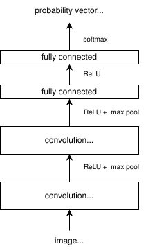
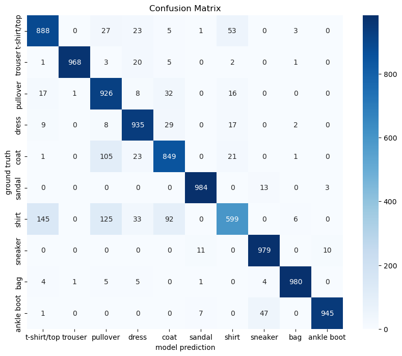
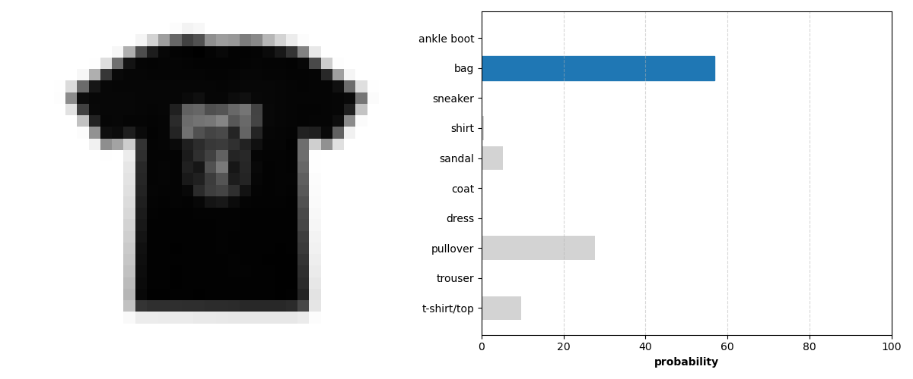
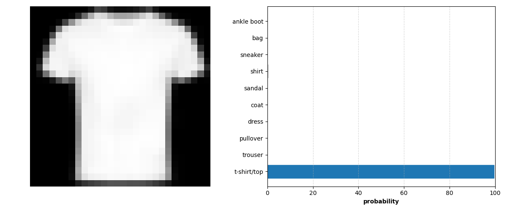

# Fashion Classification Project

This is was my first computer vision project as well as my first ML project. It consists of a convolutional neural network that classifies images of clothing items. It is trained on the Fashion-MNIST dataset.

## Files
- Data loaders are set up in [dataset.py](dataset.py).
- The architecture is implemented in [model.py](model.py).
- The training loop can be found in [train_pipeline.ipynb](train_pipeline.ipynb).
- The results from evaluation over the testing set are in [evaluation.ipynb](evaluation.ipynb).
- A demonstration of the use of the model, along with some results, are in [predict.py](predict.py).
- Some helpful functions are defined in [utils.py](utils.py).

## Personal Learning Objectives
- Familiarize myself with the PyTorch library
- Consolidate my understanding of basic CNN design and architecture (including )
- Consolidate my understanding of machine learning concepts (gradient descent, backpropagation, etc.)
- Design my first CNN, my first practical experience with machine learning and computer vision!

## Technical, Functional, Performance Objectives
- Classify Fashion-MNIST images with accuracy >90% 
- Use a convolutional neural network
- Limit use of PyTorch library to the following purposes: 
	- Autograd
	- Raw convolutional blocks
	- Optimizers (e.g., SGD, Adam, RMSProp)
	- Data management (`torch.utils.data.Dataset` and `DataLoader`)
	- Hardware acceleration (`.to('cuda')` or `.to('mps')`)
	- ❌ **No** pre-trained models, high-level wrappers or pre-packaged loss libraries

## About Fashion MNIST
- A dataset of 28x28 greyscale images each belonging to one of 10 classes (0 to 9).
- There are 60 000 images in the training set, plus 10 000 images in the testing set
- The classes as as follows:

| Label | Category        |
| ----- | --------------- |
| **0** | **T-shirt/top** |
| **1** | **Trouser**     |
| **2** | **Pullover**    |
| **3** | **Dress**       |
| **4** | **Coat**        |
| **5** | **Sandal**      |
| **6** | **Shirt**       |
| **7** | **Sneaker**     |
| **8** | **Bag**         |
| **9** | **Ankle boot**  |

## Design and training specifications

In this project, I used a convolutional neural network. The architecture is shown below:

  

In addition, here are some specifications about the design and training of the model:
- Pixel values were normalized using the transformation $\displaystyle x:=\frac {x-0.5}{0.5}$ before being passed into the model.
- Images in training batches were shuffled so that the model would be trained independently of the order of the images.
- Training loop was run for 5 epochs.
- We used the cross entropy loss function, calculated as $\displaystyle L = -\log p_c$, where $p_c$ is the probability outputted by the model, corresponding to the correct ground truth class.
- Adam was used for optimization.

## Results

The model achieved an accuracy of 90.53% on test data. 

The confusion matrix is shown below. Notice that the off-diagonal entries with the highest scores correspond to reasonable mistakes. E.g., the confusion between shirts and t-shirts/tops (145 incorrect predictions) is reasonable since the general shape of shirts is quite similar to that of a t-shirt/top.

Below are some examples of testing with images I found on the internet. One interesting observation is that the model seems to made mistakes when the background of the new image was white or light-coloured, as in the example below. The example images were obtained from the sources listed at the bottom of this page.

**Image 1**

This seems to make sense since all the images in Fashion-MNIST have a black background, so the model was not trained to properly recognize images with a dark background. This constitutes one of the limitations of the model.

However, on the images with a dark background, the model seems to perform well, such as the image below. In that respect, the model was successful.

**Image 2**

### Image Sources

Image 1: https://www.uoftbookstore.com/U-of-T-Circular-Signature-T-Shirt_2?srsltid=AfmBOooymtFFQVijFwUqBEYfbE7VIgncpSJAPrmv8o5vqvy93V1ANZqJ

Image 2: https://www.shutterstock.com/image-photo/white-blank-tshirt-front-black-background-1349895596